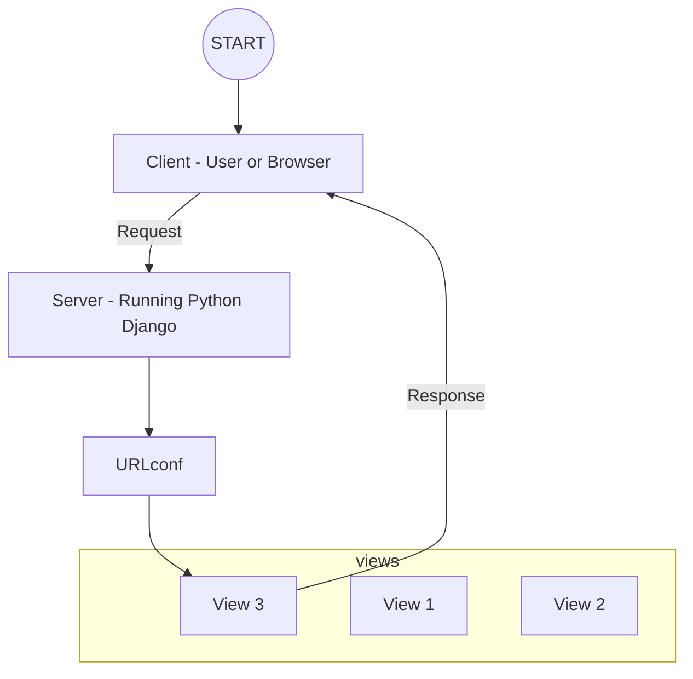

# Django 101

## Setup

### Install Python

Install latest version of Python from https://www.python.org/downloads/ which is v3.12.0 at the line of creating this project.

### Install Django & Upgrade PIP

```bash
python -m pip install Django

python -m pip install --upgrade pip
```

### Create a Django Project

```bash
django-admin startproject <PROJECT_NAME>
```

### Start Django Dev Server

```bash
python manage.py runserver
```

Open http://127.0.0.1:8000/ in browser.

### Create Django Apps ~= Modules

```bash
python manage.py startapp <APP_OR_MODULE_NAME>
```

## URLs (Routes) & Views



### URL

URLconfs/Routes: URL-Action mappings which ensure that certain results are "achieved" when certain URLs are entered by the user.

### Views

The logic (function or class) that is executed for different URLs (and HTTP methods). The code handles (evaluates, load and prepare data or run any other business logic) requests and returns responses (eg, HTML).
