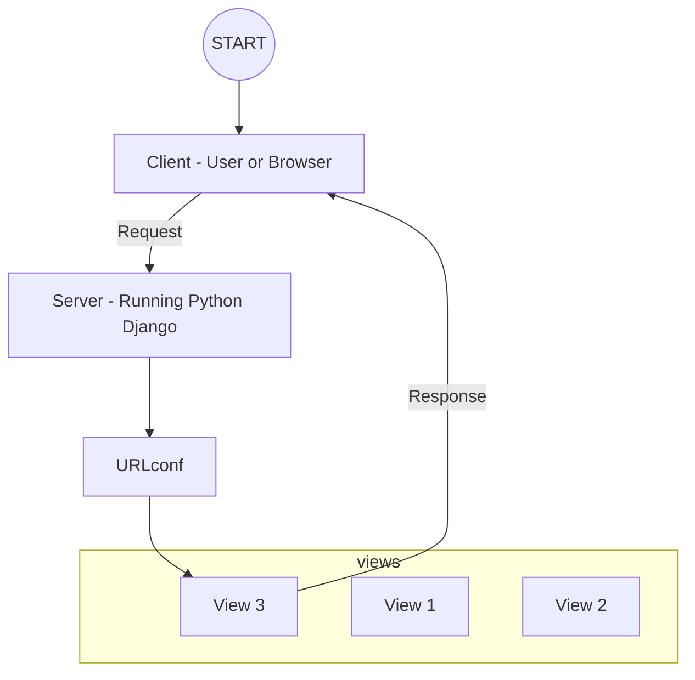

# Django 101

## Setup

### Install Python

Install latest version of Python from https://www.python.org/downloads/ which is v3.12.0 at the line of creating this project.

### Install [Django](https://docs.djangoproject.com/en/4.2/) & Upgrade PIP

```bash
python -m pip install Django

python -m pip install --upgrade pip
```

### Create Project

```bash
django-admin startproject <PROJECT_NAME>
```

### Start Dev Server

```bash
python manage.py runserver
```

Open http://127.0.0.1:8000/ in browser.

### Create Apps ~= Modules

```bash
python manage.py startapp <APP_OR_MODULE_NAME>
```

## URLs (Routes) & Views



### URL

URLconfs/Routes: URL-Action mappings which ensure that certain results are "achieved" when certain URLs are entered by the user.

### Views

The logic (function or class) that is executed for different URLs (and HTTP methods). The code handles (evaluates, load and prepare data or run any other business logic) requests and returns responses (eg, HTML).

## Models

Create a db.squalite3 file in the project root directory

Add <APP_OR_MODULE_NAME> in the `<PROJECT_NAME>/settings.py` file

```python
INSTALLED_APPS = [
    ...
    '<APP_OR_MODULE_NAME>'
]
```

```bash
# to create migration file after adding/updating the model files
python manage.py makemigrations

# to apply migrations to the db
python manage.py migrate

# to interact with the db in the shell
python manage.py shell
Python 3.12.0 (tags/v3.12.0:0fb18b0, Oct  2 2023, 13:03:39) [MSC v.1935 64 bit (AMD64)] on win32
Type "help", "copyright", "credits" or "license" for more information.
(InteractiveConsole)

# to choose the model you want to interact with
>>> from <APP_OR_MODULE_NAME>.models import <MODEL_NAME>


### create (to save the data to the db) ###

>>> <model_name> = <MODEL_NAME>(<FIELD_NAME_1>="<FIELD_VALUE>", <FIELD_NAME_2>="<FIELD_VALUE>")
>>> <model_name>.save()

>>> <MODEL_NAME>.objects.create(<FIELD_NAME_1>="<FIELD_VALUE>", <FIELD_NAME_2>="<FIELD_VALUE>")


### update (to update existing data in the db) ###

>>> <model_name> = <MODEL_NAME>.objects.all()[0]
>>> <model_name>.age = 25
>>> <model_name>.save()


### delete (to delete existing data in the db) ###

>>> <model_name> = <MODEL_NAME>.objects.all()[0]
>>> <model_name>.delete()


### read (to get data from the db wrt selected model) ###

>>> <MODEL_NAME>.objects.all()
<QuerySet [<MODEL_NAME:...>, ...]> # returns all values

>>> <MODEL_NAME>.objects.get(<UNIQUE_FIELD_NAME>="<FIELD_VALUE>")
<<MODEL_NAME>:...> # always returns single value, only use this on fields that will return single value or else it will throw error. The condition should only match a singel item in the table

>>> from django.shortcuts import get_object_or_404
>>> get_object_or_404(User, pk=user_id) # always returns single value, only use this on fields that will return single value or else it will throw error. The will check using the primary key and if it cant find the data will reurn the 404.html error page from the root template folder

>>> <MODEL_NAME>.objects.filter(<GENERIC_FIELD_NAME>="<FIELD_VALUE>")
<QuerySet [<<MODEL_NAME>:...>, ...]> # returns multiple values, use this on fields that can return multiple values

>>> <MODEL_NAME>.objects.filter(<CHAR_FIELD_NAME>__icontains="<FIELD_VALUE>", <GENERIC_FIELD_NAME>="<FIELD_VALUE>", ...)
<QuerySet [<<MODEL_NAME>:...>, ...]> # returns multiple values, use this on fields that can return multiple values, filters are AND type.

>>> from django.db.models import Q
>>> <MODEL_NAME>.objects.filter(Q(<CHAR_FIELD_NAME>__icontains="<FIELD_VALUE>") | Q(<INTEGER_FIELD_NAME>__lt="<FIELD_VALUE>") | ...)
<QuerySet [<MODEL_NAME:...>, ...]>  # returns multiple values, use this on fields that can return multiple values, filters are OR type.

>>> from django.db.models import Q
>>> <MODEL_NAME>.objects.filter(Q(<CHAR_FIELD_NAME>__icontains="<FIELD_VALUE>") | Q(<INTEGER_FIELD_NAME>__lt="<FIELD_VALUE>"), Q(<GENERIC_FIELD_NAME>="<FIELD_VALUE>"))
<QuerySet [<MODEL_NAME:...>, ...]>  # returns multiple values, use this on fields that can return multiple values, filters are OR and AND type.  `|` is OR, `,` is AND. AND filter can be used with OR without wrapping it in Q() but it has to come at the end or else it will throw error.

>>> data = <MODEL_NAME>.objects.filter(<GENERIC_FIELD_NAME>="<FIELD_VALUE>")
>>> print(data) # this is more performant because django caches the data and if this is printed muktiple times it only hits the db once unless the db data has changed, which is not the case if we directly do `print(<MODEL_NAME>.objects.filter(<GENERIC_FIELD_NAME>="<FIELD_VALUE>"))`

```

## Admin

```bash
python manage.py createsuperuser
Username (leave blank to use 'anupk'): <USERNAME>
Email address: <EMAIL>
Password: <PASSWORD>
Password (again): <PASSWORD>
The password is too similar to the username.
This password is too short. It must contain at least 8 characters.
Bypass password validation and create user anyway? [y/N]: y
Superuser created successfully.
```
