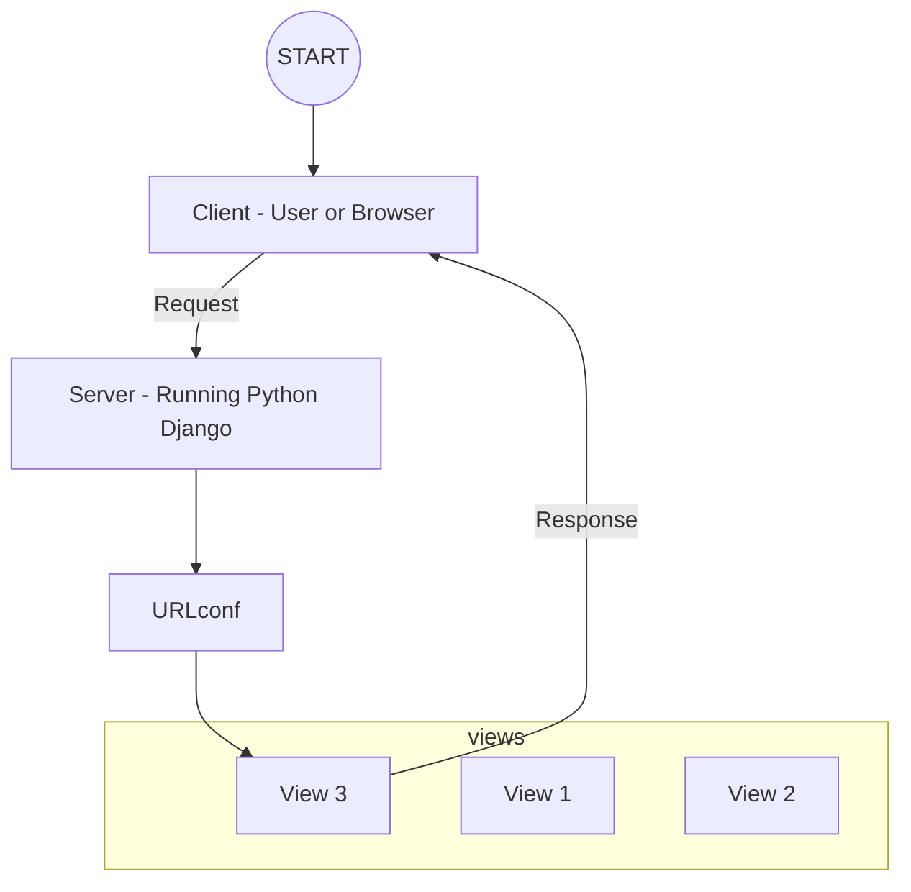

# Django 101

## Setup

### Install Python

Install latest version of Python from https://www.python.org/downloads/ which is v3.12.0 at the line of creating this project.

### Install [Django](https://docs.djangoproject.com/en/4.2/) & Upgrade PIP

```bash
python -m pip install Django

python -m pip install --upgrade pip
```

### Create Project

```bash
django-admin startproject <PROJECT_NAME>
```

### Start Dev Server

```bash
python manage.py runserver
```

Open http://127.0.0.1:8000/ in browser.

### Create Apps ~= Modules

```bash
python manage.py startapp <APP_OR_MODULE_NAME>
```

## URLs (Routes) & Views



### URL

URLconfs/Routes: URL-Action mappings which ensure that certain results are "achieved" when certain URLs are entered by the user.

### Views

The logic (function or class) that is executed for different URLs (and HTTP methods). The code handles (evaluates, load and prepare data or run any other business logic) requests and returns responses (eg, HTML).

## Models

Create a db.squalite3 file in the project root directory

Add <APP_OR_MODULE_NAME> in the `<PROJECT_NAME>/settings.py` file

```python
INSTALLED_APPS = [
    ...
    '<APP_OR_MODULE_NAME>'
]
```

```bash
# to create migration file after adding/updating the model files
python manage.py makemigrations

# to apply migrations to the db
python manage.py migrate

# to interact with the db in the shell
python manage.py shell
Python 3.12.0 (tags/v3.12.0:0fb18b0, Oct  2 2023, 13:03:39) [MSC v.1935 64 bit (AMD64)] on win32
Type "help", "copyright", "credits" or "license" for more information.
(InteractiveConsole)

# to choose the model you want to interact with
>>> from <APP_OR_MODULE_NAME>.models import <MODEL_NAME>


### create (to save the data to the db) ###

>>> <model_name> = <MODEL_NAME>(<FIELD_NAME_1>="<FIELD_VALUE>", <FIELD_NAME_2>="<FIELD_VALUE>")
>>> <model_name>.save()

>>> <MODEL_NAME>.objects.create(<FIELD_NAME_1>="<FIELD_VALUE>", <FIELD_NAME_2>="<FIELD_VALUE>")


### update (to update existing data in the db) ###

>>> <model_name> = <MODEL_NAME>.objects.all()[0]
>>> <model_name>.age = 25
>>> <model_name>.save()


### delete (to delete existing data in the db) ###

>>> <model_name> = <MODEL_NAME>.objects.all()[0]
>>> <model_name>.delete()


### read (to get data from the db wrt selected model) ###

>>> <MODEL_NAME>.objects.all()
<QuerySet [<MODEL_NAME:...>, ...]> # returns all values

>>> <MODEL_NAME>.objects.get(<UNIQUE_FIELD_NAME>="<FIELD_VALUE>")
<<MODEL_NAME>:...> # always returns single value, only use this on fields that will return single value or else it will throw error. The condition should only match a singel item in the table

>>> from django.shortcuts import get_object_or_404
>>> get_object_or_404(User, pk=user_id) # always returns single value, only use this on fields that will return single value or else it will throw error. The will check using the primary key and if it cant find the data will reurn the 404.html error page from the root template folder

>>> <MODEL_NAME>.objects.filter(<GENERIC_FIELD_NAME>="<FIELD_VALUE>")
<QuerySet [<<MODEL_NAME>:...>, ...]> # returns multiple values, use this on fields that can return multiple values

>>> <MODEL_NAME>.objects.filter(<CHAR_FIELD_NAME>__icontains="<FIELD_VALUE>", <GENERIC_FIELD_NAME>="<FIELD_VALUE>", ...)
<QuerySet [<<MODEL_NAME>:...>, ...]> # returns multiple values, use this on fields that can return multiple values, filters are AND type.

>>> from django.db.models import Q
>>> <MODEL_NAME>.objects.filter(Q(<CHAR_FIELD_NAME>__icontains="<FIELD_VALUE>") | Q(<INTEGER_FIELD_NAME>__lt="<FIELD_VALUE>") | ...)
<QuerySet [<MODEL_NAME:...>, ...]>  # returns multiple values, use this on fields that can return multiple values, filters are OR type.

>>> from django.db.models import Q
>>> <MODEL_NAME>.objects.filter(Q(<CHAR_FIELD_NAME>__icontains="<FIELD_VALUE>") | Q(<INTEGER_FIELD_NAME>__lt="<FIELD_VALUE>"), Q(<GENERIC_FIELD_NAME>="<FIELD_VALUE>"))
<QuerySet [<MODEL_NAME:...>, ...]>  # returns multiple values, use this on fields that can return multiple values, filters are OR and AND type.  `|` is OR, `,` is AND. AND filter can be used with OR without wrapping it in Q() but it has to come at the end or else it will throw error.

>>> data = <MODEL_NAME>.objects.filter(<GENERIC_FIELD_NAME>="<FIELD_VALUE>")
>>> print(data) # this is more performant because django caches the data and if this is printed muktiple times it only hits the db once unless the db data has changed, which is not the case if we directly do `print(<MODEL_NAME>.objects.filter(<GENERIC_FIELD_NAME>="<FIELD_VALUE>"))`

```

## Admin

```bash
python manage.py createsuperuser
Username (leave blank to use 'anupk'): <USERNAME>
Email address: <EMAIL>
Password: <PASSWORD>
Password (again): <PASSWORD>
The password is too similar to the username.
This password is too short. It must contain at least 8 characters.
Bypass password validation and create user anyway? [y/N]: y
Superuser created successfully.
```

## Cross Model Query

```bash
python manage.py shell
Python 3.12.0 (tags/v3.12.0:0fb18b0, Oct  2 2023, 13:03:39) [MSC v.1935 64 bit (AMD64)] on win32
Type "help", "copyright", "credits" or "license" for more information.
(InteractiveConsole)
>>> from user.models import User, PhoneNo, Passport, Access
>>> ab = User.objects.get(pk="1")
>>> ab
<User: Absinthe Minded (absintheminded@yopmail.com) - 28 - absinthe-minded>
>>> ph1 = PhoneNo(country_code="+91", number="9866098765", user=ab)
>>> ph1.save()
>>> ph11 = PhoneNo.objects.get(pk="1")
>>> ph11.user
<User: Absinthe Minded (absintheminded@yopmail.com) - 28 - absinthe-minded>
>>> p = Passport(number="3518561",  user=ab)
>>> p.save()
>>> PhoneNo.objects.filter(user__age="28")
<QuerySet [<PhoneNo: PhoneNo object (1)>]>
>>> PhoneNo.objects.filter(user__age__gt="25")
<QuerySet [<PhoneNo: PhoneNo object (1)>]>
>>> ab3 = User.objects.get(pk="1")
>>> ab3.phone_nos.all()
<QuerySet [<PhoneNo: PhoneNo object (1)>]>
>>> ab3.phone_nos.get(country_code="+91")
<PhoneNo: PhoneNo object (1)>
>>> am = User.objects.get(pk="1")
>>> a1 = Access(type="READ")
>>> am.access.add(a1)
>>> a1.save()
>>> am.access.add(a1)
```

## Circular Relations & Lazy Relations

Sometimes, you might have two models that depend on each other - i.e. you end up with a circular relationship.

Or you have a model that has a relation with itself.

Or you have a model that should have a relation with some built-in model (i.e. built into Django) or a model defined in another application.

Below, you find examples for all three cases that include Django's solution for these kinds of "problems": Lazy relationships. You can also check out the official docs in addition.

1. Two models that have a circular relationship

```python
class Product(models.Model):
  # ... other fields ...
  last_buyer = models.ForeignKey('User')

class User(models.Model):
  # ... other fields ...
  created_products = models.ManyToManyField('Product')
```

In this example, we have multiple relationships between the same two models. Hence we might need to define them in both models. By using the model name as a string instead of a direct reference, Django is able to resolve such dependencies.

2. Relation with the same model

```python
class User(models.Model):
  # ... other fields ...
  friends = models.ManyToManyField('self')
```

The special self keyword (used as a string value) tells Django that it should form a relationship with (other) instances of the same model.

3. Relationships with other apps and their models (built-in or custom apps)

```python
class Review(models.Model):
  # ... other fields ...
  product = models.ForeignKey('store.Product') # '<appname>.<modelname>'
```

You can reference models defined in other Django apps (no matter if created by you, via python manage.py startapp <appname> or if it's a built-in or third-party app) by using the app name and then the name of the model inside the app.

## Class Views

### View Example

```py
# urls.py
from . import views

urlpatterns = [
    path("", views.SampleView.as_view(), name="all-samples-path"),
]
```

```py
# views.py
from django.views import View

class SampleView(View):
    def get(self, request):
        return render(request, "sample/sample.html", {
            "samplae_data": data
        })

    def post(self, request):
```

### Template View Example

```py
# urls.py
from . import views

urlpatterns = [
    path("", views.SampleView.as_view(), name="all-samples-path"),
]
```

```py
# views.py
from django.views.generic.base import TemplateView

class SampleView(TemplateView):
    template_name = "sample/sample.html"

    def get_context_data(self, **kwargs: Any) -> dict[str, Any]:
        sample_id = kwargs["id"] # id passes as param
        context = super().get_context_data(**kwargs)
        context["template_data"] = "some data to show in template"
        return context
```

### List View Example

```py
# urls.py
from . import views

urlpatterns = [
    path("", views.SampleView.as_view(), name="all-samples-path"),
]
```

```py
# views.py
from django.views.generic import ListView

class SampleView(ListView):
    template_name = "sample/sample.html"
    model = SampleModel
    context_object_name = "samples" # use in tample to loop over the list data

    def get_queryset(self):
        base_query = super().get_query_set()
        data = base_query.filter(rating__gt=4)
        return data
```

### Detail View Example

```py
# urls.py
from . import views

urlpatterns = [
    path("<int:pk>", views.SampleView.as_view(), name="single-sample-path"),
]
```

```py
# views.py
from django.views.generic import DetailView
from .models import SampleModel

class SampleView(DetailView):
    template_name = "sample/sample.html"
    model = SampleModel
    context_object_name = "sample" # sets the model name or `object` and takes the get context from the param in urls set as `samples/<int:pk>`
```

### Form View Example

```html
<!-- sample.html -->
<form method="POST" action="/">
    {{ form }}  
  <div class="form-control  errors ">
    {{ field.label_tag }} {{ field }} {{ field.errors }}
  </div>
  
  <button type="submit">Submit</button>
</form>
```

```py
# urls.py
from . import views

urlpatterns = [
    path("<int:pk>", views.SampleView.as_view(), name="single-sample-path"),
]
```

```py
# views.py
from django.views.generic.edit import FormView
from .forms import SampleForm

class SampleView(FormView):
    form_class = SampleForm
    template_name = "sample/sample.html"
    success_url = "/success"

    def form_valid(self, form):
        form.save()
        return super().form_valid(form)
```

### Create View Example

```html
<!-- sample.html -->
<form method="POST" action="/">
    {{ form }}  
  <div class="form-control  errors ">
    {{ field.label_tag }} {{ field }} {{ field.errors }}
  </div>
  
  <button type="submit">Submit</button>
</form>
```

```py
# urls.py
from . import views

urlpatterns = [
    path("<int:pk>", views.SampleView.as_view(), name="single-sample-path"),
]
```

```py
# views.py
from django.views.generic.edit import CreateView
from .forms import SampleForm
from .models import SampleModel

class SampleView(CreateView):
    model = SampleModel
    form_class = SampleForm # optional or set fields like below, but this gives more control as we cannot set label and all here ike we can in Custom Form Models
    # fields = "__all__" # same as custom SampleForm
    template_name = "sample/sample.html"
    success_url = "/success"
```

### Update & Delete View is also Possible

https://docs.djangoproject.com/en/4.2/ref/class-based-views/generic-editing/

## File Upload

```py
# urls.py
from . import views

urlpatterns = [
    path("", views.CreateProfile.as_view(), name="create-profile-path"),
    path("list", views.ViewProfile.as_view(), name="view-profile-path")
]
```

### Saving Using View

```html
<!-- templates/profile/index.html -->
<form action="/profile/" method="POST" enctype="multipart/form-data">
  
  <input type="file" name="image" />
  <button>Upload</button>
</form>
```

```py
# views.py
from django.views import View
from django.http import HttpResponseRedirect

store_file(file):
    with open("temp/image.jpeg", "wb+") as dest:
        for chunk in file.chunks()
            dest.write(chunk)

class CreateProfileView(View):
    def get(self, request):
        return render(request, "profile/index.html")

    def post(self, request):
        store_file(request.FILES["image"])
        return HttpResponseRedirect("/profile")
```

### Saving Using Form

```html
<!-- templates/profile/index.html -->
<form action="/profile/" method="POST" enctype="multipart/form-data">
   {{ form }}
  <button>Upload</button>
</form>
```

```py
# forms.py
from django import forms

class ProfileForm(forms.Form):
    user_image = forms.FileField()

```

```py
# views.py
from django.views import View
from django.http import HttpResponseRedirect

from .forms import ProfileForm

store_file(file):
    with open("temp/image.jpeg", "wb+") as dest:
        for chunk in file.chunks()
            dest.write(chunk)

class CreateProfileView(View):
    def get(self, request):
        form = ProfileForm()
        return render(request, "profile/index.html", {
            "form": form
        })

    def post(self, request):
        submitted_form = ProfileForm(request.POST, request.FILES)

        if (submitted_form.is_valid()):
            store_file(request.FILES["image"])
            return HttpResponseRedirect("/profile")

        return render(request, "profile/index.html", {
            "form": submitted_form
        })
```

### Saving Using Model

```html
<!-- templates/profile/index.html -->
<form action="/profile/" method="POST" enctype="multipart/form-data">
   {{ form }}
  <button>Upload</button>
</form>
```

```py
# models.py
from django.db import models

class Profile(models.Model):
    image = models.FileField(upload_to="files") # files folder will be created in MEDIA_ROOT
    # image = models.ImageField(upload_to="images") # django will only accespt images and not pdfs and docs # need to install Pillow "python -m pip insll Pillow"
```

```py
# settings.py
MEDIA_ROOT = BASE_DIR / "uploads"
MEDIA_URL = "/user-media/"
```

```py
# forms.py
from django import forms

class ProfileForm(forms.Form):
    user_image = forms.FileField()
    # user_image = forms.ImageField()

```

```py
# views.py
from django.views import View
from django.http import HttpResponseRedirect

from .forms import ProfileForm
from .models import Profile

class CreateProfileView(View):
    def get(self, request):
        form = ProfileForm()
        return render(request, "profile/index.html", {
            "form": form
        })

    def post(self, request):
        submitted_form = ProfileForm(request.POST, request.FILES)

        if (submitted_form.is_valid()):
            profile = Profile(image=request.FILES["image"])
            profile.save()
            return HttpResponseRedirect("/profile")

        return render(request, "profile/index.html", {
            "form": submitted_form
        })
```

### Saving Use Create View

```html
<!-- templates/profile/index.html -->
<form action="/profile/" method="POST" enctype="multipart/form-data">
   {{ form }}
  <button>Upload</button>
</form>
```

```py
# models.py
from django.db import models

class Profile(models.Model):
    image = models.FileField(upload_to="files") # files folder will be created in MEDIA_ROOT
    # image = models.ImageField(upload_to="images") # django will only accespt images and not pdfs and docs # need to install Pillow "python -m pip insll Pillow"
```

```py
# settings.py
MEDIA_ROOT = BASE_DIR / "uploads"
```

```py
# views.py
from django,views,generic.edit import CreateView
from .models import Profile

class CreateProfileView(CreateView):
    template_name = "profile/index.html"
    model = Profile
    fields = "__all__"
    success_url = "/profiles"
```

### Serving Use List View

```html
<!-- templates/profile/index.html -->
<ul>
  
  <li>
    
  </li>
  
</ul>
```

```py
# models.py
from django.db import models

class Profile(models.Model):
    image = models.FileField(upload_to="files") # files folder will be created in MEDIA_ROOT
    # image = models.ImageField(upload_to="images") # django will only accespt images and not pdfs and docs # need to install Pillow "python -m pip insll Pillow"
```

```py
# settings.py
MEDIA_ROOT = BASE_DIR / "uploads"
MEDIA_URL = "/user-media/"

from django.conf import settings
from django.contrib import admin
from django.conf.urls.static import static
from django.urls import path, include

urlpatterns = [
    path('profile/', include("profile.urls")),
] + static(settings.MEDIA_URL, document_root=settings.MEDIA_ROOT) # needed to allow django to server files, the mapping of the url to the actual path on the file system is done by this static function call in the root settings urls.py
```

```py
# forms.py
from django import forms

class ProfileForm(forms.Form):
    user_image = forms.FileField()
    # user_image = forms.ImageField()

```

```py
# views.py
from django.views.generic import ListView
from .models import Profile

class ViewProfileView(ListView):
    template_name = "profile/index.html"
    model = Profile
    context_object_name = "profiles"
```

## (Sessions)[https://docs.djangoproject.com/en/4.2/ref/settings/#sessions]

```py
# settings.py

INSTALLED_APPS = [
    'django.contrib.sessions'
]

MIDDLEWARE = [
    'django.contrib.sessions.middleware.SessionMiddleware'
]
```

```py
# urls.py
urlpatterns = [
    path("users/<int:user_id>", views.UserSessionView.as_view(), name="specific-user-path-id")
]

```

```py
# views.py

class UserSessionView(View):
    def get(self, request):
        user_id = request.POST["user_id"]
        loaded_user = User.objects.get(pk=user_id)
        saved_session_user_id = self.request.session.get("user_id")
        return render(request, "user/user.html", {
            "is_user_session_saved": loaded_user.id === saved_session_user_id
        })


    def post(self, request):
        user_id = request.POST["user_id"]
        request.session["user_id"] = user_id # saves data to session, dont store objects from db just store primitive values like dictionary
        redirect_path = reverse("specific-user-path-id", args=[user_id])
        return HttpResponseRedirect(redirect_path)
```
